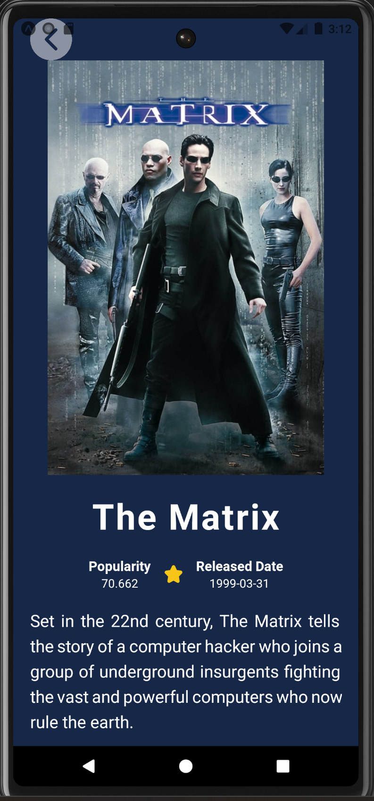

# Movie App with React Native

This App is a React Native-based mobile application designed to provide users with an immersive movie and TV show browsing experience. Leveraging the power of The Movie Database's (TMDb) open API, this App offers a seamless interface to explore a vast array of movies and TV shows, along with comprehensive details about each selection.

[](https://skillicons.dev)
## API Reference
:link: https://api.themoviedb.org/3/

## Movies :film_strip:
#### Now Playing

Get a list of movies that are currently in theatres.
```http
  GET movie/now_playing
```

| Parameter | Type     | Description                |
| :-------- | :------- | :------------------------- |
| `api_key` | `string` | **Required**. Your API key |

#### Popular

Get a list of movies ordered by popularity.
```http
  GET movie/popular
```

| Parameter | Type     | Description                |
| :-------- | :------- | :------------------------- |
| `api_key` | `string` | **Required**. Your API key |

#### Top Rated

Get a list of movies ordered by rating.
```http
  GET movie/top_rated
```

| Parameter | Type     | Description                |
| :-------- | :------- | :------------------------- |
| `api_key` | `string` | **Required**. Your API key |

#### Upcoming

Get a list of movies that are being released soon.
```http
  GET movie/upcoming
```

| Parameter | Type     | Description                |
| :-------- | :------- | :------------------------- |
| `api_key` | `string` | **Required**. Your API key |

## TV :tv:
#### Airing Today

Get a list of TV shows airing today.
```http
  GET tv/airing_today
```

| Parameter | Type     | Description                |
| :-------- | :------- | :------------------------- |
| `api_key` | `string` | **Required**. Your API key |

#### On The Air

Get a list of TV shows that air in the next 7 days.
```http
  GET tv/on_the_air
```

| Parameter | Type     | Description                |
| :-------- | :------- | :------------------------- |
| `api_key` | `string` | **Required**. Your API key |

#### Popular

Get a list of TV shows ordered by popularity.
```http
  GET tv/popular
```

| Parameter | Type     | Description                |
| :-------- | :------- | :------------------------- |
| `api_key` | `string` | **Required**. Your API key |

#### Top Rated

Get a list of TV shows ordered by rating.
```http
  GET tv/top_rated
```

| Parameter | Type     | Description                |
| :-------- | :------- | :------------------------- |
| `api_key` | `string` | **Required**. Your API key |


## Search :eyes:
#### Movie
Search for movies by their original, translated and alternative titles.
```http
  GET search/movie?{query}
```

| Parameter | Type     | Description                       |
| :-------- | :------- | :-------------------------------- |
| `query`      | `string` | **Required**. query string required |

#### Multi
Use multi search when you want to search for movies, TV shows and people in a single request.
```http
  GET search/multi?{query}
```

| Parameter | Type     | Description                       |
| :-------- | :------- | :-------------------------------- |
| `query`      | `string` | **Required**. query string required |

#### TV
Search for TV shows by their original, translated and also known as names.
```http
  GET ssearch/tv?{query}
```

| Parameter | Type     | Description                       |
| :-------- | :------- | :-------------------------------- |
| `query`      | `string` | **Required**. query string required |


## Environment Variables

To run this project, you will need to add the following environment variables to your .env file

`API_KEY`


## Authors :black_nib:

- [@alvelx](https://github.com/alvelx)


## Screenshots :camera_flash:




## Run Locally :floppy_disk:

Clone the project

```bash
  git clone https://github.com/alvelx/movie-app
```

Go to the project directory

```bash
  cd my-project
```

Install dependencies

```bash
  npm install
```

Start the server

```bash
  npx expo start
```

